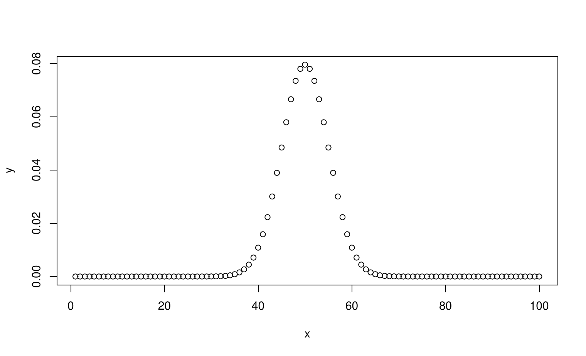

:::::: article
## Introduction

Pandoc naturally converts verbatim environment easily, however the
redefination of other commands such as example, example\*, Sinput etc to
verbatim does not work well in pandoc.

Hence, the [**texor**](https://CRAN.R-project.org/package=texor) package
uses a stream editor to search find and replace matching code
environments to verbatim before pandoc touches it.

This way the the code is not lost in conversion, also a pandoc extension
is used to add attributes to the markdown code using
`fenced_code_attributes`

Code Environment types are well summarized in the table
[1](#tab:T1){reference-type="ref" reference="table:1"}

::: {#table:1}
  ------------------------------------------------------------------------------
  Code Environment Type                                                  
  ----------------------- --------------- ----------- -------- --------- -------
  Example                 example         example\*                      

  S.series                Sin             Sout        Sinput   Soutput   Scode

  Special Verbatim        boxedverbatim                                  
  ------------------------------------------------------------------------------

  : (#tab:T1) Code Environment support in texor
:::

## Environments

### Verbatim Series

While verbatim is naturally supported in pandoc,other extensions of
verbatim environment like boxedverbatim from moreverb package
[@moreverb] falls back to normal verbatim.

1\. verbatim :

``` r
print("Hello world")
```

2\. boxedverbatim :

``` r
print("Hello world")
```

### S series

S series code environement is defined in Rjournal.sty file. Most of
these are extensions of verbatim environment and retain the original
formatting of the content in HTML.

1\. Sinput :

``` r
print("Hello world")
```

2\. Soutput :

``` r
[1] "hello world"
```

3\. Sin :

``` r
print("Hello world")
```

4\. Sout :

``` r
[1] "hello world"
```

### Example series

Example series of code environment is defined in Rjournal.sty file.
Examples are extensions of verbatim environment and retain the original
formatting of the content in HTML.

1\. example :

``` r
print("Hello world")
```

2\. example\* :

``` r
print("Hello world")
```

## Code in Figure Environments

A small example of this is visble in
[1](#code:example){reference-type="ref" reference="code:example"}. This
is a common practice in Rnews articles as it used to add a boxed border
around the code which looks attractive. However, in web articles there
isn't much advantage to it.

<figure id="code:example">
<div class="center">
<div class="sourceCode" id="cb1"><pre class="sourceCode r"><code class="sourceCode r"><span id="cb1-1"><a href="#cb1-1" aria-hidden="true" tabindex="-1"></a>code_in_figure <span class="ot">&lt;-</span> <span class="cf">function</span>() {</span>
<span id="cb1-2"><a href="#cb1-2" aria-hidden="true" tabindex="-1"></a>  <span class="cf">if</span> (pandoc_version <span class="sc">&gt;=</span> <span class="dv">3</span>) {</span>
<span id="cb1-3"><a href="#cb1-3" aria-hidden="true" tabindex="-1"></a>    <span class="fu">print</span>(<span class="st">&quot;Code in Figure Supported&quot;</span>)</span>
<span id="cb1-4"><a href="#cb1-4" aria-hidden="true" tabindex="-1"></a>  }</span>
<span id="cb1-5"><a href="#cb1-5" aria-hidden="true" tabindex="-1"></a>  <span class="cf">else</span> {</span>
<span id="cb1-6"><a href="#cb1-6" aria-hidden="true" tabindex="-1"></a>    <span class="fu">print</span>(<span class="st">&quot;code in Figure not supported&quot;</span>)</span>
<span id="cb1-7"><a href="#cb1-7" aria-hidden="true" tabindex="-1"></a>  }</span>
<span id="cb1-8"><a href="#cb1-8" aria-hidden="true" tabindex="-1"></a>}</span></code></pre></div>
</div>
<figcaption>Figure 1: Example Code inside Figure
environment</figcaption>
</figure>

Pandoc v3 or greater [@pandoc] has a Figure object which allows
non-image figures to be treated like one. This is why
[**texor**](https://CRAN.R-project.org/package=texor) package requires
atleast version 3 of pandoc.

## Code in Table Environments

We can use code environments in a table using minipage environments.
This is not a common practice among LaTeX article authors, but a few
articles had such complex structures. So, as a example to demonstrate
pandoc and [**texor**](https://CRAN.R-project.org/package=texor)
package's capabilities, I have included a few of them.

Table [2](#tab:T2){reference-type="ref" reference="table:2"} is an
example of code environments within a table.

::: {#table:2}
+----------+---------------------------------+
| Language | Function Defination Syntax      |
+:========:+:===============================:+
| R        | ::: minipage                    |
|          | ``` r                           |
|          | fun <- function(){              |
|          |   print("A function in R")      |
|          |   return(0)                     |
|          | }                               |
|          | ```                             |
|          | :::                             |
+----------+---------------------------------+
| Python   | ::: minipage                    |
|          | ``` r                           |
|          | def fun():                      |
|          |   print("A function in Python") |
|          | ```                             |
|          | :::                             |
+----------+---------------------------------+
| Lua      | ::: minipage                    |
|          | ``` r                           |
|          | function fun()                  |
|          |   print("A function in Lua")    |
|          | end                             |
|          | ```                             |
|          | :::                             |
+----------+---------------------------------+

: (#tab:T2) Code in a table
:::

A similar arrangement can be had for figures/plots besides code
environment. Table [3](#tab:T3){reference-type="ref"
reference="table:3"} demonstrates a table with code and figure.

::: {#table:3}
+-------------------------------+-------------------------------------+
| Code                          | Plot                                |
+:=============================:+:===================================:+
| ::: minipage                  | ::: minipage                        |
| ``` r                         | {width="100%"    |
| x <- 1:100                    | alt="graphic without alt text"}     |
| y <- dbinom(x,100,prob = 0.5) | :::                                 |
| plot(x,y)                     |                                     |
| ```                           |                                     |
| :::                           |                                     |
+-------------------------------+-------------------------------------+

: (#tab:T3) Code and Plot side by side
:::

## Inline Code usage

Using inline code in LaTeX is possible using `\verb` command. It would
be repoduced similarly, as a Inline code element.

``` r
\verb|x <- 1:100|
```

will be represented as `x <- 1:100` in Inline format.

## Code chunks using Schunk

Code chunks within an `Schunk` environment to demonstrate Input/Output

Input :

``` r
print("Hello world")
```

Output :

``` r
[1] "hello world"
```

Similar arrangement can be had for Plots as well using figure
environnment.

Input :

``` r
x <- 1:100
y <- dbinom(x,100,prob = 0.5)
plot(x,y)
```

Output :\
{width="100%" alt="graphic without alt text"}

## Including 'R code chunks'

Including R code chunks in an article that is to be converted to R
markdown can be a bit tricky as the
[**knitr**](https://CRAN.R-project.org/package=knitr) package will
interpret and execute the R code chunks as actual code bits. A
workaround for this issue has been described in this [posit support
article](https://support.posit.co/hc/en-us/articles/360018181633-Including-verbatim-R-code-chunks-inside-R-Markdown).
Below is an example with the workaround adapted from [@rcodechunks].

```` r
`r ''````{r}
plot(cars)
```
````

## Summary

In summary the [**texor**](https://CRAN.R-project.org/package=texor)
package supports:

-   Almost all code environments in RJournal.

-   Code Highlight for R language.

-   Inline Code.

-   Code in different environments like tables/figures.
::::::
