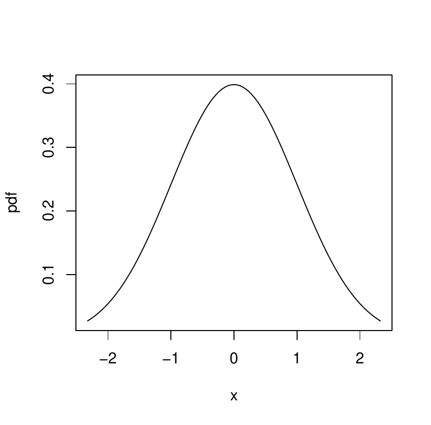

:::: article
## Introduction

Images are an essential component of any article, however, due to the
differences in support for various graphic formats between LaTeX and
markdown/HTML we need to fall back on raster graphics. The support for
different image formats across markup languages is summarized in
Table [1](#tab:T1){reference-type="ref" reference="table:1"}.

::: {#table:1}
  -------------------------------------------------------
  Graphics Format   LaTeX   Markdown   Rmarkdown   HTML
  ----------------- ------- ---------- ----------- ------
  PNG               Yes     Yes        Yes         Yes

  JPG               Yes     Yes        Yes         Yes

  PDF               Yes     No         No          No

  SVG               No      Yes        Yes         Yes

  Tikz              Yes     No         Yes         No

  Algorithm         Yes     No         No          No
  -------------------------------------------------------

  : (#tab:T1) Image Format support in various Markup/Typesetting
  Languages
:::

## Image with width parameters

The following code includes an image with width parameters, producing
the output in Figure [1](#figure:rlogo){reference-type="ref"
reference="figure:rlogo"}.

``` r
\begin{figure}[htbp]
  \centering
  \includegraphics[width=0.35\textwidth]{Rlogo-5.png}
  \caption{The logo of R.}
  \label{figure:rlogo}
\end{figure}
```

{#figure:rlogo width="35.0%"
alt="graphic without alt text"}

This is the most basic example of figure. Similarly PDF figures will be
included as rasterized images.

## Multiple images

Pandoc v3 and above now support a new `Figure` object [@pandoc] which
supports multiple images side by side or in a grid format. The following
subsections demonstrate these capabilities.

#### Two or more Images side by side

``` r
\begin{figure}[htbp]
  \centering
  \includegraphics[width=0.45\textwidth]{Rlogo-5.png}\includegraphics[width=0.45\textwidth]{normal}
  \caption{Images side by side}
  \label{fig:twoimages}
\end{figure}
```

<figure id="fig:twoimages">
<p></p>
<figcaption>Figure 2: Images side by side</figcaption>
</figure>

#### Four Images in a grid

``` r
\begin{figure}[htbp]
  \centering
  \includegraphics[width=0.45\textwidth]{Rlogo-5.png}\includegraphics[width=0.45\textwidth]{normal}
 

  \includegraphics[width=0.45\textwidth]{normal}\includegraphics[width=0.45\textwidth]{Rlogo-5.png}
  \caption{Multiple images in a grid}
  \label{fig:fourimages}
\end{figure}
```

<figure id="fig:fourimages">
<p></p>
<p></p>
<figcaption>Figure 3: Multiple images in a grid</figcaption>
</figure>

## Tikz images

The **texor** package supports tikz images by rasterizing it and making
it web friendly. Figure [4](#fig:tikz){reference-type="ref"
reference="fig:tikz"} shows a tikz image adapted from [@casflow].

#### Tikz Code:

The image in Figure [4](#fig:tikz){reference-type="ref"
reference="fig:tikz"} is a graphical representation of how **texor**
handles tikz images:

-   Figures containing tikz images are isolated.

-   Tikz libraries are fetched from the wrapper file.

-   The Tikz code section is isolated into a standalone LaTeX file and
    compiled.

-   The compiled LaTeX file generates a PDF Image.

-   This is converted to PNG format for embedding in the HTML output.

-   `\includegraphics{tikz/somefigure.png}` is added to the figure
    environment.

-   A lua filter removes redundant text the figure environment.

If you use **texor** to convert your articles using
`texor::latex_to_web()` with `temp_mode=TRUE`(it is `TRUE` by default).
The resultant Rmarkdown/HTML file will not modify the contents of your
LaTeX file. In this case you can keep reloading the article after making
changes to the tikz images, without having to do the above steps
manually in case you are converting the article by hand.

<figure id="fig:tikz">


<figcaption>Figure 4: Tikz Image example</figcaption>
</figure>

## Algorithm2e diagrams

Diagrams and images using the `algorithm2e` environment are supported,
these will be numbered differently. We strongly suggest to use \"alg:\"
in labels for best results. As a part of the filtering requires \"alg:\"
to number algorithm references seperately, otherwise they will share
references with normal figures.

Algorithm [1](#alg:how){reference-type="ref" reference="alg:how"} is an
example from the **algorithm2e** vignette [@algoexample].

<figure id="alg:how">


<figcaption>Algorithm 1: How to write algorithms</figcaption>
</figure>

## Other elements in figure objects

Figures can also house non-image environments like code blocks. Code
blocks in figure environments would share numbering with normal figures,
similar to LaTeX. Here Figure [5](#code:example){reference-type="ref"
reference="code:example"} refers to a code block.

<figure id="code:example">
<div class="center">
<div class="sourceCode" id="cb1"><pre class="sourceCode r"><code class="sourceCode r"><span id="cb1-1"><a href="#cb1-1" aria-hidden="true" tabindex="-1"></a>code_in_figure <span class="ot">&lt;-</span> <span class="cf">function</span>() {</span>
<span id="cb1-2"><a href="#cb1-2" aria-hidden="true" tabindex="-1"></a>  <span class="cf">if</span> (pandoc_version <span class="sc">&gt;=</span> <span class="dv">3</span>) {</span>
<span id="cb1-3"><a href="#cb1-3" aria-hidden="true" tabindex="-1"></a>    <span class="fu">print</span>(<span class="st">&quot;code in figure supported&quot;</span>)</span>
<span id="cb1-4"><a href="#cb1-4" aria-hidden="true" tabindex="-1"></a>  }</span>
<span id="cb1-5"><a href="#cb1-5" aria-hidden="true" tabindex="-1"></a>  <span class="cf">else</span> {</span>
<span id="cb1-6"><a href="#cb1-6" aria-hidden="true" tabindex="-1"></a>    <span class="fu">print</span>(<span class="st">&quot;code in figure not supported&quot;</span>)</span>
<span id="cb1-7"><a href="#cb1-7" aria-hidden="true" tabindex="-1"></a>  }</span>
<span id="cb1-8"><a href="#cb1-8" aria-hidden="true" tabindex="-1"></a>}</span></code></pre></div>
</div>
<figcaption>Figure 5: Example Code inside Figure
environment</figcaption>
</figure>

## Limitations

The limitations of [**texor**](https://CRAN.R-project.org/package=texor)
package in figure handling are:

-   Animations using the **animation** package in LaTeX wont be
    supported. The authors can include GiF equivalents of the same in
    the Rmarkdown/web article.

-   Multi-page PDF files are currently not supported.

-   Usage of subfigure,sclaebox,wrapfigure environments will not work as
    intended.

-   Currently only `[width=X.X\textwdith]` format is supported for
    defining the width in web article (default width would be 100% in
    other cases).

-   Other `\inclduegraphics[..]` options will be ignored.

## Summary

In summary the [**texor**](https://CRAN.R-project.org/package=texor)
package supports:

-   Multiple images in grid,side-by-side configuration.

-   Image Captions with Numbering and Labelling.

-   Algorithm2e and tikz figures.
::::
