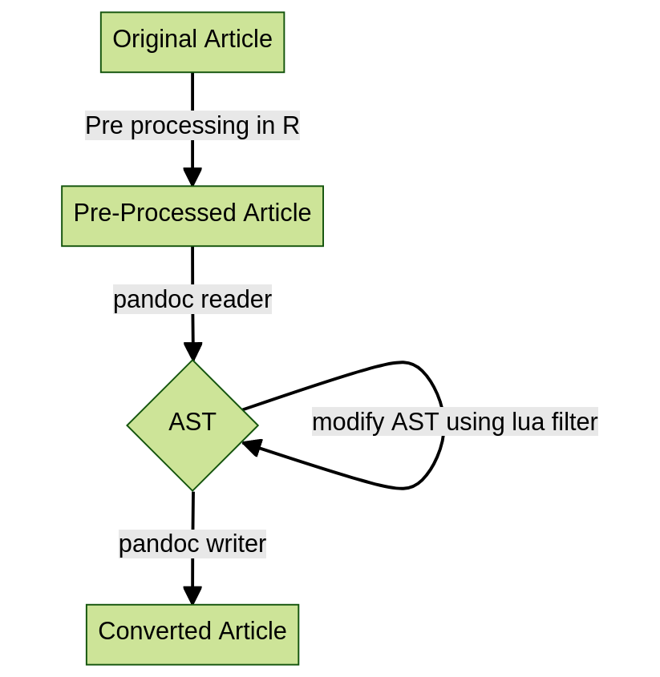
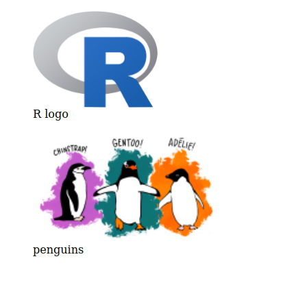

:::: article
## Introduction

To fully understand pandoc filters, one must first grasp the document
conversion process. Pandoc will read/parse an article and then store it
internally as an intermediate form, known as an abstract syntax tree
(AST). Then, A document writer(a specialized type-setter) will read the
AST and produce the contents in the chosen article format. Converting
markdown to HTML, for example, will entail these pandoc operations.
Figure [1](#fig:workflow){reference-type="ref" reference="fig:workflow"}
shows the conversion workflow within pandoc.

{#fig:workflow
width="60.0%" alt="graphic without alt text"}

When specific elements require adjustment, the Lua filters enter the
picture. Assume you're converting markdown to HTML and want the page to
have automated numbering for figures or tables. If you use markdown,
there is no system for automatically numbering figures/tables; to retain
1:1 conversion, the HTML output will also lack numbering.

At this point, you might wish there was a way to add such a feature. But
including every customization as an option in pandoc or the writer is
not viable. To address this, the idea of filters emerged, with which you
could modify the AST before the writer could read it to obtain the
desired result [@pandocfilters].

Pandoc filters can technically be written in any language (called JSON
filters) [^1].

## Need of Lua filters

Continuing the example above, let's create a dummy article, where we
need to add numbering. One way could be to keep a counter of images, and
add a prefix `"Figure X :"` to each figure caption. This will serve the
purpose of numbering the images in the end result.

``` r
{width="10%"}

{width="15%"}
```

<figure id="code:2">
<div class="sourceCode" id="cb1"><pre class="sourceCode r"><code class="sourceCode r"><span id="cb1-1"><a href="#cb1-1" aria-hidden="true" tabindex="-1"></a>pandoc example.md <span class="sc">--</span>from markdown <span class="sc">--</span>to html5 <span class="sc">--</span>output example.html</span></code></pre></div>
<figcaption>Figure 2: pandoc command without lua filter or
extensions.</figcaption>
</figure>

Now if we convert the above markdown file to HTML5 using the pandoc
command in Figure [2](#code:2){reference-type="ref" reference="code:2"},
we get Figure [3](#fig:1){reference-type="ref" reference="fig:1"}.

{#fig:1
width="50%"}

As we can see, there is no figure numbering done automatically, which is
generally the expected result. If we want to include numbering, we would
need to write a Lua filter. This Lua filter will modify the AST and make
the changes we desire.

We call a Lua filter in the pandoc command show in
Figure [2](#code:2){reference-type="ref" reference="code:2"} using the
` --lua-filter name_of_filter.lua` option in pandoc.

In the next section we write a Lua filter to manipulate the figures in
Figure [4](#code:3){reference-type="ref" reference="code:3"}.

## Writing pandoc Lua filters

<figure id="code:3">
<div class="sourceCode" id="cb1"><pre class="sourceCode r"><code class="sourceCode r"><span id="cb1-1"><a href="#cb1-1" aria-hidden="true" tabindex="-1"></a>figures <span class="ot">=</span> <span class="dv">0</span></span>
<span id="cb1-2"><a href="#cb1-2" aria-hidden="true" tabindex="-1"></a>is_fig <span class="ot">=</span> <span class="dv">0</span></span>
<span id="cb1-3"><a href="#cb1-3" aria-hidden="true" tabindex="-1"></a></span>
<span id="cb1-4"><a href="#cb1-4" aria-hidden="true" tabindex="-1"></a><span class="cf">function</span> <span class="fu">Figure</span>(el)</span>
<span id="cb1-5"><a href="#cb1-5" aria-hidden="true" tabindex="-1"></a>      local label <span class="ot">=</span> <span class="st">&quot;&quot;</span></span>
<span id="cb1-6"><a href="#cb1-6" aria-hidden="true" tabindex="-1"></a>      <span class="fu">pandoc.walk_block</span>(el,{ Image <span class="ot">=</span> <span class="cf">function</span>(el)</span>
<span id="cb1-7"><a href="#cb1-7" aria-hidden="true" tabindex="-1"></a>                     is_fig <span class="ot">=</span> <span class="dv">1</span></span>
<span id="cb1-8"><a href="#cb1-8" aria-hidden="true" tabindex="-1"></a>                     end})</span>
<span id="cb1-9"><a href="#cb1-9" aria-hidden="true" tabindex="-1"></a>      <span class="cf">if</span> is_fig <span class="sc">==</span> <span class="dv">1</span> then</span>
<span id="cb1-10"><a href="#cb1-10" aria-hidden="true" tabindex="-1"></a>	        figures <span class="ot">=</span> figures <span class="sc">+</span> <span class="dv">1</span></span>
<span id="cb1-11"><a href="#cb1-11" aria-hidden="true" tabindex="-1"></a>	        label <span class="ot">=</span> <span class="st">&quot;Figure &quot;</span> .. <span class="fu">tostring</span>(figures) .. <span class="st">&quot;:&quot;</span></span>
<span id="cb1-12"><a href="#cb1-12" aria-hidden="true" tabindex="-1"></a>      end</span>
<span id="cb1-13"><a href="#cb1-13" aria-hidden="true" tabindex="-1"></a>	    local caption <span class="ot">=</span> el.caption</span>
<span id="cb1-14"><a href="#cb1-14" aria-hidden="true" tabindex="-1"></a>	    <span class="cf">if</span> not caption then</span>
<span id="cb1-15"><a href="#cb1-15" aria-hidden="true" tabindex="-1"></a>          caption <span class="ot">=</span> {<span class="fu">pandoc.Str</span>(label)}</span>
<span id="cb1-16"><a href="#cb1-16" aria-hidden="true" tabindex="-1"></a>    	<span class="cf">else</span></span>
<span id="cb1-17"><a href="#cb1-17" aria-hidden="true" tabindex="-1"></a>          caption <span class="ot">=</span> {<span class="fu">pandoc.Str</span>(label),<span class="fu">pandoc.Space</span>()}</span>
<span id="cb1-18"><a href="#cb1-18" aria-hidden="true" tabindex="-1"></a>    	end</span>
<span id="cb1-19"><a href="#cb1-19" aria-hidden="true" tabindex="-1"></a>    	el.caption.long[<span class="dv">1</span>].content <span class="ot">=</span> caption .. el.caption.long[<span class="dv">1</span>].content</span>
<span id="cb1-20"><a href="#cb1-20" aria-hidden="true" tabindex="-1"></a>    	is_fig <span class="ot">=</span> <span class="dv">0</span></span>
<span id="cb1-21"><a href="#cb1-21" aria-hidden="true" tabindex="-1"></a>    	return el</span>
<span id="cb1-22"><a href="#cb1-22" aria-hidden="true" tabindex="-1"></a>end</span></code></pre></div>
<figcaption>Figure 4: A Lua filter to add figure numbering.</figcaption>
</figure>

Everything in Lua revolves around tables; for example, the pandoc AST or
the document is one giant table with sub-tables.

In pandoc, there are two sorts of elements: '`Blocks`' and '`Inlines`'.
'`Blocks`' are complicated constructions constructed from simpler pieces
('`Inlines`'). A '`Para`', for example, is a '`Block`' made up of
several '`Str`' '`Inlines`'.

The first step in writing a filter is to select a target type, that is,
which '`Block`' or '`Inline`' this filter will target. Following the
selection, we name the function after the target type and each element
in the argument as '`el`'. For instance, in the case of our filter, it
would be `function Figure(el)`. Pandoc is smart enough to match the
names of filter functions to the AST elements.

Now within the filter function we can assume that `el` will contain the
table object of a Figure element from the document. We can use many
functions over it or '`Inlines`' contained in it. One such function to
walk over all the elements inside the block is `walk_block`. Walk
functions are a great way to check or count the presence of certain
elements in a block. We use `walk_block` to check if there are any
'`Image`' inline elements within the '`Figure`' block. This is because
after pandoc 3 [@pandoc] '`Figure`' blocks can now contain elements
other than '`Images`' as well.

If there is an `Image` then we append `"Figure X :"` to the caption of
the `Figure` element. and return the modified element.

## Interpreting changes using Lua filters

The filter in Figure [4](#code:3){reference-type="ref"
reference="code:3"} when included in the pandoc command will generate
Figure [6](#fig:2){reference-type="ref" reference="fig:2"} using the
command in Figure [5](#code:4){reference-type="ref" reference="code:4"}.

<figure id="code:4">
<div class="sourceCode" id="cb1"><pre class="sourceCode r"><code class="sourceCode r"><span id="cb1-1"><a href="#cb1-1" aria-hidden="true" tabindex="-1"></a>pandoc example.md <span class="sc">--</span>from markdown <span class="sc">--</span>to html5 <span class="sc">--</span>output filtered<span class="sc">-</span>example.html</span>
<span id="cb1-2"><a href="#cb1-2" aria-hidden="true" tabindex="-1"></a><span class="sc">--</span>lua<span class="sc">-</span>filter image_numbering_filter.lua</span></code></pre></div>
<figcaption>Figure 5: pandoc command with Lua filter.</figcaption>
</figure>

{#fig:2 width="50%"}

## Usage of pandoc lua filters in the [**texor**](https://CRAN.R-project.org/package=texor) package

Pandoc Lua filters are used in the
[**texor**](https://CRAN.R-project.org/package=texor) package to modify
the AST for various markups. Table [1](#tab:T1){reference-type="ref"
reference="tab:filters"} summarizes the use of each filter.

::: {#tab:filters}
  --------------------------------------------------------------------------------------------------------------------------------------------------------------------------------------
  File Name                       Description
  ------------------------------- ------------------------------------------------------------------------------------------------------------------------------------------------------
  `abs_filter.lua`                Filters out unicode `182` character.

  `bib_filter.lua`                Clears out the bibliography from the article itself as it will be added to the metadata.

  `R_code.lua`                    Adds a class component `'r'` to CodeBlocks for code highlighting.

  `image_filter.lua`              Fixes extensions for image paths without an extension or with `.pdf` extension.

  `table_caption.lua`             Adds table numbering in the captions similar to the ones found in R Markdown and [**kable**](https://CRAN.R-project.org/package=kable)-based tables.

  `image_caption.lua`             Adds Figure/Algorithm numbering as well as clears out residuals of tikz/algorithm images.

  `conversion_compat_check.lua`   This filter keeps a count of all `Inline` and `Block` elements and writes it to a yaml file.

  `equation_filter.lua`           Adds [**bookdown**](https://CRAN.R-project.org/package=bookdown) style equation numbering to LaTeX equation/math environments.

  `bookdown_ref.lua`              Corrects numbering for various elements.

  `issue_checker.lua`             Searches and notifies any occurrence of unrecognized math commands.

  `find_pdf_files.lua`            This filter creates a list for all image PDF files included in the article.

  `widetable_patcher.lua`         This filter sets the representation for widetables.
  --------------------------------------------------------------------------------------------------------------------------------------------------------------------------------------

  : (#tab:T1) A summary of all Lua filters used in the
  [**texor**](https://CRAN.R-project.org/package=texor) package
  (available in the
  [/inst](https://github.com/Abhi-1U/texor/tree/master/inst) folder of
  the package).
:::
::::

[^1]: More on this [here](https://pandoc.org/filters.html).
