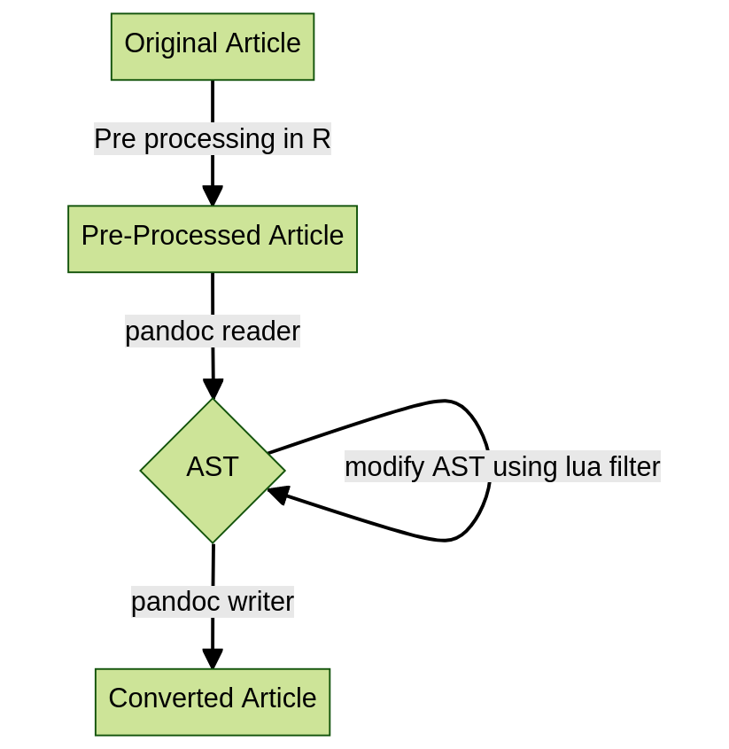
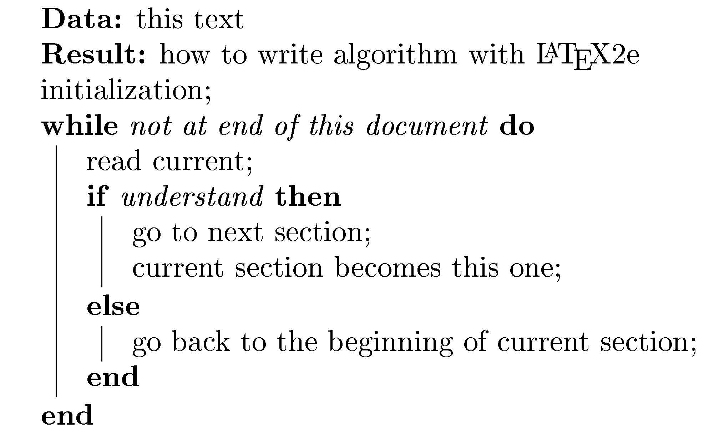

```{r setup, include=FALSE}
knitr::opts_chunk$set(echo = FALSE, warning = FALSE, message = FALSE)
library(plotly)
library(ggplot2)
```

# Introduction

The R Journal is the primary open-access outlet for publications produced by the R community. It was born in 2008, evolving from a newsletter, that ran from 2001, into a more formal article publication to encourage documenting statistical computing research. 

The format is regularly updated. Early articles were typeset using LaTeX [@latex], from a specific, but changing, template. This requires that code is separated from the documentation, and there is a chance that code chunks in the paper don't reproduce the results reported. With the emergence of dynamic document systems like R Markdown [@rmarkdown] a tight-coupling of code and documentation is possible. Code chunks are dynamically executed when the document is typeset using a system like \CRANpkg{knitr} [@knitr], making reporting of computing research more reproducible. 

In 2019, with the help of funding from the R Consortium it was decided that it was time to update operations. One aspect of this was to change from LaTeX paper submissions to a more reproducible format, where code was embedded in the document, and the output could be both HTML and pdf. There are numerous benefits of HTML format: 

1. Articles can include interactive graphics and tables.
2. The format is more accessible to screen readers making the work more accessible to vision-impaired researchers.

<!-- traditional HTML is the most universally accessible format - Australian Human Rights Commission https://humanrights.gov.au/our-work/disability-rights/world-wide-web-access-disability-discrimination-act-advisory-notes-ver and https://printdisability.org -->

This latter point is a reason to consider converting all of the legacy articles into HTML. 

A key decision for creating conversion software was to decide to directly convert LaTeX to HTML, or PDF to HTML, or LaTeX to R Markdown, and then use the current journal tools to create the HTML. The latter approach was decided to be the most versatile and useful. If an article can be converted from LaTeX to R Markdown, it would help authors make the transition to reproducible publishing, beyond what the R Journal needed. Once an article is in R Markdown format it can be adapted to include the code for dynamic execution.

In addition to article format, changes to the web site structure were important for delivering the publication. Web site architectures are also constantly evolving, and the emergence of \CRANpkg{distill} [@distill] allows for the journal web site to optimally deliver R Markdown articles.

The \CRANpkg{rjtools} was developed to create articles using R Markdown for the R Journal, and to embed them into the journal web site. The packages described here, \CRANpkg{texor} and \CRANpkg{rebib} describes software to convert legacy LaTeX format articles into Rmarkdown, so that they can be rendered in HTML in the new web site. 

The paper is organised as follows. Section 2 gives an overview of the conversion process, that includes pre-processing using regular expressions, post-processing using Lua filters, and handling of figures, tables and equations. Section 3 describes the \CRANpkg{texor} that handles most of the conversion. Section 4 describes tools to do special handling of bibliography files. The supplementary materials have folders containing specific examples that can be used for understanding how the conversions are done.

<!--
Describe changes in templates, and web site. Desirability to convert the legacy articles. Decided to convert latex input to Rmd, rather than directly html and why.

- R Journal latex template and formatting
- Quirks of the legacy articles
-->

# The internals of converting from LaTeX to R Markdown {#internals}

The decision to convert to R Markdown format means that the final output to pdf and HTML will depend on Pandoc [@pandoc].  Pandoc is a versatile document conversion program written in Haskell that is core to numerous documentation systems, including R Markdown and Quarto. Pandoc first converts a document into an abstract syntax tree. From this, it can convert to a different format, including custom ones. <!-- Although creating bespoke writers/readers in `Lua` can be challenging, pandoc includes filters that allow users to customize the output generated based on matching patterns plus some logic to modify them. -->

Pandoc can be used to do the conversion from LaTeX to R Markdown also. However, additional pre-processing needs to be done to handle special R Journal LaTeX styling. And further post-processing needs to be done to handle specific R Journal R Markdown styling. The \CRANpkg{texor} package contains functionality to handle this pre- and post-processing of the document, in a workflow illustrated in Figure \@ref(fig:workflow). 

<!-- uses these filters heavily, even for simple tasks like choosing which supporting figures to copy. A `Lua` filter constructs a list of image paths, stores them momentarily and the package uses this data to copy images. However, \CRANpkg{texor} also includes many pre-processing functions that employ regular expressions. This is needed to convert some text and LaTeX commands that are not recognized or handled by Pandoc. -->

```{r workflow, fig.cap="Workflow of the document conversion conducted by texor.", out.width="70%", fig.align='center'}

```


## Pre-processing using regular expressions 

LaTeX is very descriptive language, that allows authors substantial freedom for customization. Markdown [@markdown], on which R Markdown is based, is more restrictive and was born to make it easier to create web pages without the distraction of a gazillion HTML tags. The beauty of Markdown is that it allows the author to focus on writing, without format cluttering the text. The drawback is that it is simple typesetting, optimized for web delivery.

While Pandoc can do most of the heavy-lifting, it cannot cope with all the freedom with which LaTeX documents are written. An example of this is with formatting of code. Pandoc only handles the `verbatim` environment, but there are many ways to format code in LaTeX, and the R Journal template has a special `\code{}` command. If the code environment is not verbatim, then Pandoc will also try to process the actual code content as LaTeX commands and will likely lose details. It is better to convert these synonyms into `verbatim` environments this prior to passing the document to Pandoc.

The functions in \CRANpkg{texor} that handle the pre-processing using regular expressions are:

- `stream_editor()`: operates like the `sed` function in unix [@unix] and allows generic text pattern matching and replacing.
- `patch_code_env()`: replaces the common code environments, `code`, `example`, `Sin`, `Sout`, `Scode`, `Sinput`, `smallverbatim`, `boxedverbatim`, `smallexample` with `verbatim`.
- `patch_equations()`: coordinates various equation environments.
- `patch_figure_env()`: coordinates various figure environments.
- `patch_table_env()`: coordinates table environments.

These functions are verbose and describe all the changes being made. They also create a backup of the original file before making the changes. 

<!-- by syntax though you can always embed HTML to expand the feature set. Although Pandoc does most of the heavy lifting, there are some instances where even  filters cannot assist. A good demonstration of the issue in hand is code environments.-->

<!-- A limitation of Pandoc is that it only works with a "verbatim" environment. However, in "RJournal",  we have multiple custom code environments which are not supported or defined due to lower-level tex limitations in Pandoc. So the code  environments are eliminated during the conversion process. Including a Lua filter to find these elements and redefine them as verbatim environments would also be  ineffective. If the code environment is not verbatim, then Pandoc will also try to process the actual code content as LaTeX commands and will lose out on details in some cases.-->

<!--**Be sure to mention the hard parts**-->


## Post-processing using Lua filters

Lua [@lua] is a programming language, that is light-weight, fast, ideal for procedural operations.  It is embedded in many other applications to allow custom scripting for extensibility. Pandoc allows users to provide custom Lua filters to produce custom output formats. The \CRANpkg{texor} package handles post-processing of the R Markdown document into the special format for the R Journal using a suite of Lua filters. 

Here is an example of a Lua filter available in \CRANpkg{texor}:

```Lua
function Div(el)
    if el.classes[1] == 'thebibliography' then
        return { }
    end
end
```

This filter reads the abstract syntax tree, selecting all the Div elements. Then it looks for the class "thebibliography." This Div element contains the LaTeX bibliographic records, that appear at the very end of papers. It should not be in the document when using the "RJ-web-article" layout, because it is added from meta-data when the R Markdown is knitted. So the Lua filter removes this section.

## Figures

### Standard, single figure

Figure definitions in LaTeX are many and varied! The standard, single figure definition with the `figure` environment and raster image format such as PNG or JPG, is handled by Pandoc. It will convert:

```
\begin{figure}[htbp]
  \centering
  \includegraphics[width=0.35\textwidth]{Rlogo-5.png}
  \caption{The logo of R.}
  \label{figure:rlogo}
\end{figure}
```

to 

```
<figure id="figure:rlogo">

<figcaption>Figure 1: The logo of R.</figcaption>
</figure>
```

### PDF format images

Images in PDF format are converted to PNG, in the pre-processing of the LaTeX document, and then post-processed using Pandoc as described above. 

### Multiple figures

Multiple figures are supported with the latest versions of Pandoc, so definitions like:

```
\begin{figure*}[htbp]
  \centering
  \includegraphics[width=0.45\textwidth]{Rlogo-5.png}
  \includegraphics[width=0.45\textwidth]{normal}
  \caption{Images side by side}
  \label{fig:twoimages}
\end{figure*}
```

will be converted to:

```
<figure id="fig:twoimages">
<p></p>
<figcaption>Figure 3: Images side by side</figcaption>
</figure>
```

### `tikz` format images

Some legacy articles define images using `tikz` commands, such as:

```
\begin{figure}

%% Generated Image will included as a PNG above automatically
  \centering
\tikzstyle{process} = [rectangle, rounded corners,
minimum width=3cm, 
minimum height=1cm,
text centered, 
draw=black]
\tikzstyle{arrow} = [thick,->,>=stealth]
\begin{tikzpicture}[node distance=4cm]
%Nodes
...

```

This is handled by pre-processing the LaTeX to create the image, as both PDF, and then PNG, for inclusion in the R Markdown document using:

```
<figure id="fig:tikz">


<figcaption>Figure 5: Tikz Image example</figcaption>
</figure>
```

### Algorithms as figures

Algorithms as figures is supported, and the following description will yield the result in Figure \@ref(fig:alghow).

```
\begin{algorithm}[htbp]
\SetAlgoLined
\KwData{this text}
\KwResult{how to write algorithm with \LaTeX2e }
initialization\;
\While{not at end of this document}{
read current\;
\eIf{understand}{
go to next section\;
current section becomes this one\;
}{
go back to the beginning of current section\;
}
}
\caption{How to write algorithms}
  \label{alg:how}
\end{algorithm}
```

```
<figure id="alg:how">

<p>initialization</p>
<figcaption>Algorithm 1: How to write algorithms</figcaption>
</figure>
```

```{r alghow, fig.cap="How to write algorithms.", out.width="60%", fig.align='center'}

```

## Equations

Math is handled primarily by Pandoc. The inline math and equation descriptions are unchanged between LaTeX and R Markdown. 

The HTML output renders math using MathJax. This does mean that some functionality, like `\bm`, `\boldmath` and `mathbb` not supported, and special definitions cannot be handled. 

The numbering of equations is a bit trickier. LaTeX automatically numbers equations, unless specifically instructed not to. Equation numbering in R Markdown requires specific labeling using `(\#eq:xx)` as described in @bookdown. The \CRANpkg{texor} helps by adding the labeling using a Lua filter to convert the existing `\label{..}` to `(\#eq:xx)`.

## Tables

Tables form one of the biggest challenges in migrating from LaTeX to R Markdown, because the sophistication is not completely replicated. However, there have been many improvements in table definitions for R Markdown that are increasing producing the beautifully crafted tables possible in LaTeX. The conversion in \CRANpkg{texor} can mostly handle the simple tables, and for producing more complex tables it may be necessary to manually edit the resulting `Rmd` file to make conditional tables, one to render specifically for HTML output using packages such as \CRANpkg{kableExtra} [@kableExtra], \CRANpkg{gt} [@gt], \CRANpkg{htmlTable} [@htmlTable], \CRANpkg{tableHTML} [@tableHTML], \CRANpkg{tables} [@tables] or \CRANpkg{DT} [@DT]. A benefit of special HTML table output is interactivity, that would allow the table to be sorted in different ways.

### Generic tables

Simple LaTeX tables are converted into traditional markdown format tables, by Pandoc. So this table definition:

```
\begin{table}[htbp]
\centering
\begin{tabular}{l | llll }
 \hline
 Graphics Format & LaTeX & Markdown & Rmarkdown & HTML \\
 \hline
 PNG       & Yes & Yes & Yes & Yes \\
 JPG       & Yes & Yes & Yes & Yes \\
 PDF       & Yes & No & No & No \\
 SVG       & No & Yes & Yes & Yes \\
 Tikz      & Yes & No & Yes & No \\
 Algorithm & Yes & No & No & No \\
\hline
\end{tabular}
\caption{Image Format support in various Markup/Typesetting Languages}
\label{table:1}
\end{table}
```

will be converted to:

```
::: {#table:1}
  -------------------------------------------------------
  Graphics Format   LaTeX   Markdown   Rmarkdown   HTML
  ----------------- ------- ---------- ----------- ------
  PNG               Yes     Yes        Yes         Yes

  JPG               Yes     Yes        Yes         Yes

  PDF               Yes     No         No          No

  SVG               No      Yes        Yes         Yes

  Tikz              Yes     No         Yes         No

  Algorithm         Yes     No         No          No
  -------------------------------------------------------

  : Table 1: Image Format support in various Markup/Typesetting
  Languages
:::
```

### Multicolumn tables

A multicolumn table requires:

1. The stream editor modifies the `\multicolumnx{..}` to
    `\multicolumnxx{..}`.

2. A LaTeX macro is used to redefine the `\multicolumnxx{..}` to
    `\multicolumnx{---}`.

3. Pandoc reads the table and transforms it to markdown.

```{asis echo=knitr::is_latex_output()}
\begin{table*}[htbp]
\begin{center}
\begin{tabular}{l | llll }
 \hline
 \multicolumn{1}{c |}{EXAMPLE} & \multicolumn{2}{c}{$X$} &
\multicolumn{2}{c}{$Y$} \\
 \hline
  & 1 & 2 & 1 & 2 \\
 EX1  & X11 & X12 &  Y11  & Y12 \\
 EX2  & X21 & X22 &  Y21  & Y22 \\
 EX3  & X31 & X32 &  Y31  & Y32 \\
 EX4  & X41 & X42 &  Y41  & Y42\\
 EX5  & X51 & X52 &  Y51  & Y52 \\
\hline
\end{tabular}
\caption{An example multicolumn table.}
\label{table:2}
\end{center}
\end{table*}
```

```{asis echo=knitr::is_html_output()}
::: center
::: {#table:2}
  -------------------------------------
  EXAMPLE   \(X\)         \(Y\)   
  --------- ------- ----- ------- -----
            1       2     1       2

  EX1       X11     X12   Y11     Y12

  EX2       X21     X22   Y21     Y22

  EX3       X31     X32   Y31     Y32

  EX4       X41     X42   Y41     Y42

  EX5       X51     X52   Y51     Y52
  -------------------------------------

  : Table 2: An Example Table with Multicolumn
:::
:::
```

Also note that the stream editor is used to rename `table*` environment to `table` environment because the markdown/HTML will not support the specific changes table\* environment will bring.

### Other tables

Tables with images, math, code or links in the cells are generally handled. Also `widetable` tables that allow for specific width or wrapping of tables into blocks are also partially handled.

## Animation

XXX Shall we describe the one pdf paper that has animation and how this is handled - could be cool to include

## Logging the conversion

XXX what should go here?

# Using \CRANpkg{texor} {#texor}

The package `texor` can be installed from CRAN using:

```
install.packages("texor")
```

and the development version from https://github.com/Abhi-1U/texor. The website for the package, https://abhi-1u.github.io/texor, has vignettes documenting usage. 

Note that you will need to use [Pandoc Version > 3.0.0 (if possible latest)]((https://pandoc.org/installing.html)) for the best results. You can check your version with:

```
rmarkdown::pandoc_version()
```

The only function that a user necessarily needs is `latex_to_web()`. This creates the R Journal style R Markdown file from a given R Journal style LaTeX file. 
This is achieved by several sequential steps, `convert_to_markdown()`, `generate_rmd()` and `produce_html()`. 

The supplementary materials have several folders with specific examples of figures, tables, equations that can be used to understand how the conversion operates.

For converting the 14 years of legacy R Journal articles, batch processing of issues was conducted. This can be achieved using:

XXX

For individuals who are interested in submitting their paper to the R Journal but have written their article using the legacy LaTeX format and wish to convert it to the new format, you can use the `latex_to_web()` function on your paper directory.

# Managing the bibliography using \CRANpkg{rebib} {#rebib}

Typically bibliographies are generated during the processing of a LaTeX article using the BibTeX software [@bibtex] operating on a `.bib` list of references. The R Journal template requires the inclusion of the `.bib` file. But LaTeX actually uses a `.bbl` format for references, which is what BibTeX generates as an intermediate format during the article processing. 

During the conversion of legacy articles, especially in the earliest published articles, it was discovered that some papers were only accompanied by the intermediate `.bbl` formatted references and often these were included directly in the `.tex` file. Sometimes articles had both references in the `.tex` and separate `.bbl` or `.bib` files. While LaTeX can technically handle either `.bbl` or `.bib` formatted references R Markdown can only handle `.bib`. 

The \CRANpkg{rebib} package was developed to handle these tricky situations. It converts embedded LaTeX bibliographies into a close BibTeX equivalent. The features of the package are:

- reading `bbl` chunks to produce a very close BibTeX equivalent.
- title and author are usually mandatory fields.
- URL, ISBN, publisher, pages and year are optional fields and will be enabled when available.
- remaining data is stored in `"journal"` (internally) and `"publisher"` (when writing BibTeX file).
- ignores commented LaTeX code.
- provides a citation tracker
- does bibliography aggregation XXX what is this?

<!-- The \CRANpkg{rebib} package addresses the issue with LaTeX articles using built-in bibliography options with or without BibTeX files. While this works  well with LaTeX, it won't work with Rmarkdown. Initially the goal was to use external software like Biber to convert the embedded bibliography to BibTeX. However the integration of external software was not viable, hence the experimental idea of a bibliography parser gained momentum. 

It was initially a part of the \CRANpkg{texor} package, as those functions grew in features and became more involved; at that point, it made sense to move those functions as a separate package. Initially, there were some reservations about the usage of \CRANpkg{rebib} and its stability with various formats. However, the package has improved over time and proven to be a good performer.-->

<!-- ## Using \CRANpkg{rebib}-->
 
The package `rebib` can be installed from CRAN using:

```
install.packages("rebib")
```

and the development version from https://github.com/Abhi-1U/rebib. The website for the package, https://abhi-1u.github.io/rebib, has vignettes documenting usage.  

# Summary

Remember only the HTML is rendered, and the original PDF is not re-generated.

Only handling to HTML format, especially relevant for figures, because the legacy pdf will remain the same. If using for converting work from LaTeX to Rmd then this will need manual changing by author. See rjtools guide.

Where this might be useful in the future, other applications.

No shift to quarto yet.


Known problems that need manual fixes.

# Acknowledgments {-}

The authors wish to thank the [Google Summer of Code](https://summerofcode.withgoogle.com) program for financially supporting Abhishek's work on this project, and the R Project Organization for their support. 
 
# Supplementary materials {-}

The supplementary materials has example folders containing LaTeX documents that allow the reader to see how different common patterns in the legacy documents are handled with the conversion. These include:

- `code-env`: Explains how different code environments defined by the R Journal style are handled, and additional details such as code in figure environments, and code in table environments. 
- `math-env`: Examples of inline math, display math, how equation numbering is handled by a Lua filter to convert from LaTeX labeling to R Markdown labeling. 
- `figure-env`: Explains how the variety of figure definitions are handled in the conversion, including different image formats, numbering, captions, labeling, multiple images, and `tikz` [@casflow] images.
- `table-env`: Examples of how a variety of table types are converted, including multicolumn, complex and wide tables.
- `lua-filters`: Overview and lots of small examples of Lua filters to handle the custom output needed for the R Markdown format.
- `metadata`: This has a collection of additional format handling including extracting metadata like author names and affiliations, article identifiers used in the review process, and handling citations, footnotes and links.
- `bibliography`: The bibliography was handled differently over the years of the journal, and this details how to use the `rebib` functionality to handle `bbl` files, embedded `bbl`, to convert into the standard `.bib` format.


In each of these folders there is a `RJwrapper.tex`, and `.tex` file, with the extra template files `RJournal.sty` and `Rlogo-5.png` and `.bib` files. These match the legacy template file structure, from which the `RJwrapper.pdf` file is created. To test the conversion for each of these examples, set the path directory to one of the folders and use the `latex_to_web()` function as follows:

```
article_dir <- "path-to-this supplementary folder"
texor::latex_to_web(article_dir)
```

This will create an `.Rmd` and `.html` files in the same directory, that demonstrate the converted R Markdown version and the HTML output format.

You'll need to ensure that you have the latest versions of \CRANpkg{texor} and \CRANpkg{rebib}, and Pandoc (at least later than version 3.0.0).

## Source materials {-}

The \CRANpkg{texor} and \CRANpkg{rebib} source code and materials to reproduce this paper are available at:

- \CRANpkg{texor}: https://abhi-1u.github.io/texor
- \CRANpkg{rebib}: https://abhi-1u.github.io/rebib/
- This paper: https://github.com/Abhi-1U/texor-rjarticle
- More details on \CRANpkg{rjtools} are at https://rjournal.github.io/rjtools/


